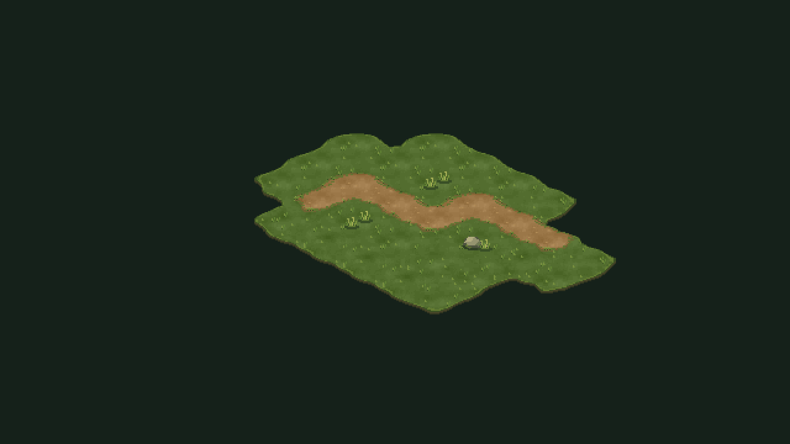
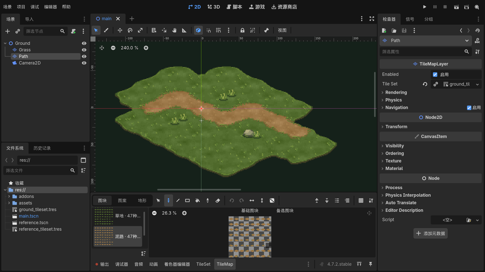

# 用 Godot 铺一条自然的像素小路

有朋友问，不规则的地面要怎么铺，才不会看起来一格一格的？这份小工程把视频里的地面单独留了下来，可以打开看看，也可以自己补几格、擦一格试试。🌿

## 这份工程里有什么

- **`complete/`**：已经铺好的小场景。草地、泥路、小草和石头都在这里，可以直接打开观察。
- **`starter/`**：只有基础场景和三张像素素材，适合跟着教程从头配置。
- **[地形标记对照图](地形标记对照.svg)**：配置 TileSet 地形连接时，照着标边、角和内部图块。
- **[详细操作教程](操作教程.md)**：从导入素材、配置图块，到铺设、擦除和保存重开。
- **[素材与依赖说明](ASSET_NOTICE.md)**：素材来源和使用范围。

## 下载和打开

从 [Releases](https://github.com/GGBond2424648901/godot-natural-ground-nocode/releases) 下载 **配套工程 ZIP** 并解压。安装 Godot 4.7.2 后，在项目管理器中导入 `complete/project.godot`，打开 `main.tscn`，按 **F6** 就能看到小场景。

想自己铺的话，选择左侧的 `Grass` 或 `Path` 图层，在下方 **TileMap → 地形** 里选对应地形，再选 **连接** 笔刷。左键铺、右键擦；补一格、擦一格时，周围的边缘会一起更新。

## 它是怎么变自然的？

素材里先画好了不同方向的边缘、转角和内部图块。Godot 根据相邻格子的地形标记，自动挑出能接上的图块；草地内部再用图块概率，换出少量纹理、小草和石头。视频里的小场景约 **7×5 格**，方便凑近看清接边。

工程使用 Godot 自带的 `TileMapLayer` 和 `TileSet`。包内没有 `.gd`、`.gdshader`、`.cs`、插件或制作视频用的辅助代码。`.tscn`、`.tres` 和 `project.godot` 是打开场景、保存地形规则所需的 Godot 资源文件。

地面的凹凸轮廓来自像素素材，连接笔刷负责铺设时匹配邻居；小草和石头是相同连接规则下的候选图块，所以每次铺设出现的位置可能不同。这个工程只演示编辑器里的地面制作，不含人物和运行时绘图功能。

## 环境

- Godot 4.7.2，Compatibility 渲染器
- 2D 像素等轴视角，逻辑网格 64×32；PNG 切片 64×64
- 无需安装插件或导入其他依赖

如果你铺出了新的转弯，也欢迎继续试试不同的草地轮廓。希望这块小地面能帮你做出自己的小世界。🌱
